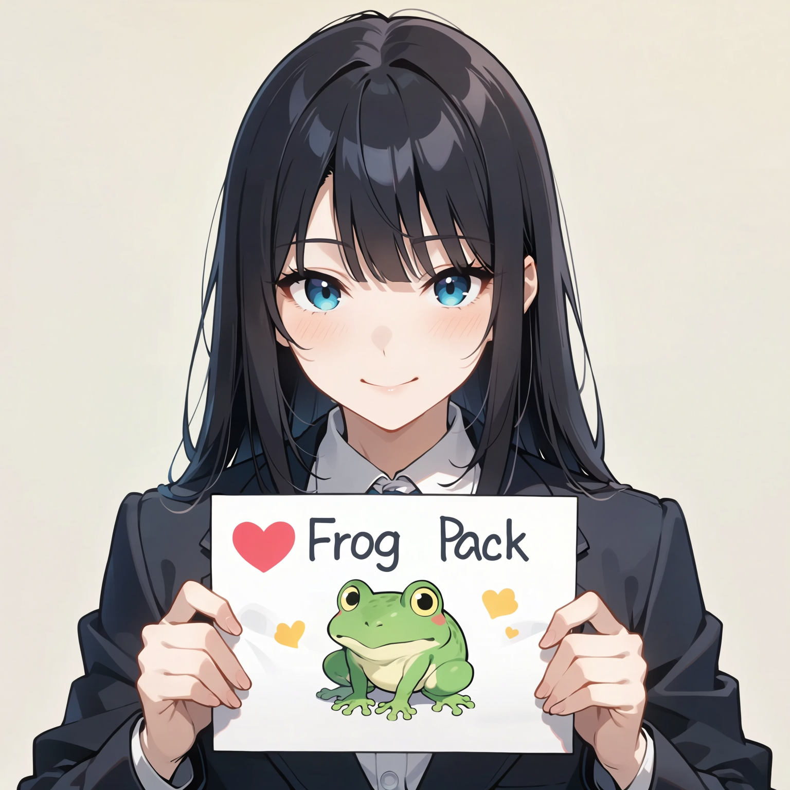
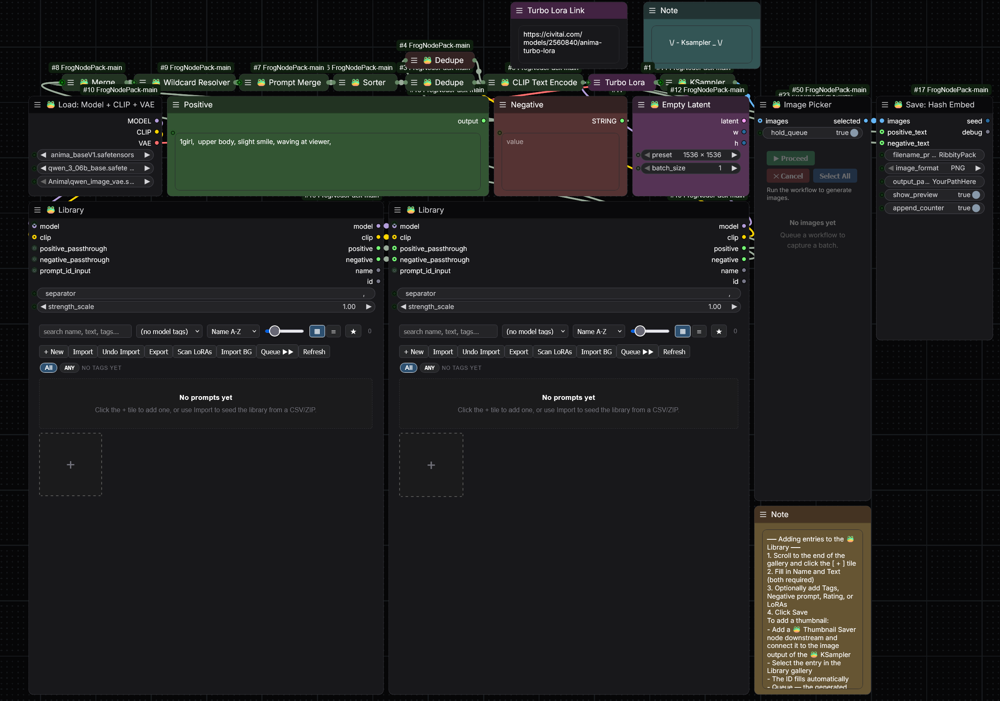

# 🐸 Frog Node Pack

A custom node pack for [ComfyUI](https://github.com/comfyanonymous/ComfyUI) focused on keeping workflows clean and consolidated. Instead of a dozen separate nodes doing one thing each, these nodes do more with fewer connections — loading, sampling, saving, prompt building, and a full visual prompt library, all under one roof.

---

## Author

Made by [RabbitThatIsPink](https://github.com/RabbitThatIsPink)

---

## Special Thanks

> **Special thanks to [Junkie](https://github.com/Deaththegrim) for base node development.**
> The wildcard engine, prompt library data layer, and several node concepts originate from Junkie's Ribbity Node Suite.

---



---

> **Workflow Note:** The included baseline workflow is configured for use with the [Anima Turbo LoRA](https://civitai.com/models/2560840/anima-turbo-lora). It includes a LoRA Loader node and a KSampler tuned to its recommended settings. You will need to download that LoRA separately before the workflow runs as intended.

---

## Installation

1. Copy the `FrogNodePack` folder into your ComfyUI `custom_nodes` directory.
   - Desktop: `<ComfyUI install>/custom_nodes/`
   - Portable: `ComfyUI_windows_portable/ComfyUI/custom_nodes/`
2. Restart ComfyUI.
3. Hard-refresh your browser (`Ctrl+Shift+R`).
4. All nodes appear under the **🐸 Node Pack** category in the node search.

> **Note:** Your personal data (`data/`, `wildcards/`) is not touched on updates.
> Library entries and wildcard files live outside the pack folder and are preserved between versions.

---

## Example Workflow

A ready-to-use baseline workflow is included in this repo: [`FrogFlow - Export Edition.json`](FrogFlow%20-%20Export%20Edition.json)

Load it in ComfyUI via **Load** → select the `.json` file. It demonstrates the standard node layout using the full Frog Node Pack — loader, CLIP encode, sampler, and save all wired together.



---

## Nodes

---

### Autocomplete Optimization Patch *(optional — requires ComfyUI-Custom-Scripts)*

Speeds up the [ComfyUI-Custom-Scripts](https://github.com/pythongosssss/ComfyUI-Custom-Scripts) autocomplete for large tag lists. The patch pre-caches the lowercased word list at load time and debounces the search trigger, eliminating repeated string allocations on every keystroke.

**How to install:**

1. Make sure [ComfyUI-Custom-Scripts](https://github.com/pythongosssss/ComfyUI-Custom-Scripts) is installed in your `custom_nodes` folder.
2. Navigate to `FrogNodePack/Autocomplete Optimization Patch - Custom Scripts/`.
3. Double-click **`Apply Patch.bat`** and follow the on-screen output.
4. Hard-refresh your browser (`Ctrl+Shift+R`).

If Custom-Scripts is not installed the script exits cleanly with no changes made. A `.bak` backup of the original file is created before any edits are written. If Custom-Scripts updates and wipes the patch, simply re-run the bat to reapply.

---

### 🐸 Load: Model + CLIP + VAE

Replaces three separate loader nodes with one. Pick your diffusion model, text encoder, and VAE from their respective dropdowns and get all three outputs in a single connection point.

| Output | Type | Description |
|--------|------|-------------|
| MODEL | MODEL | The loaded diffusion model |
| CLIP | CLIP | The loaded text encoder |
| VAE | VAE | The loaded VAE |

---

### 🐸 CLIP Text Encode

Encodes both your positive and negative prompts in one node. Wire a CLIP in, type your prompts, and get two conditioning outputs plus the raw text as strings. The text outputs are useful for wiring directly into save nodes so your metadata always reflects exactly what was encoded.

| Input | Description |
|-------|-------------|
| clip | CLIP encoder from your loader |
| positive | Your positive prompt |
| negative | Your negative prompt |

| Output | Type | Description |
|--------|------|-------------|
| Positive | CONDITIONING | Encoded positive conditioning |
| Negative | CONDITIONING | Encoded negative conditioning |
| positive_text | STRING | Your positive prompt as plain text |
| negative_text | STRING | Your negative prompt as plain text |

---

### 🐸 Empty Latent

A resolution picker with presets sized for Anima, Flux, and similar models. Choose from the dropdown and get a latent tensor ready to go, plus the width and height as integers — handy for wiring into conditioning nodes that need size information.

**Available presets:** 1536×1536 · 1728×1344 · 1344×1728 · 1856×1248 · 1248×1856 · 2016×1152 · 1152×2016 · 2304×1024 · 1024×2304

| Output | Type | Description |
|--------|------|-------------|
| latent | LATENT | Empty latent at the chosen resolution |
| w | INT | Width in pixels |
| h | INT | Height in pixels |

---

### 🐸 KSampler

Samples your latent and decodes it to an image in one node — no separate VAE Decode needed. Supports tiled decoding for high-resolution outputs that would otherwise run out of VRAM.

**Extras:**
- **Tiled** toggle — enables tiled VAE decode, useful for large resolutions
- **Tile Size** — controls the tile dimensions when tiled decode is active (default 512)
- **beta57** — adds the `beta57` scheduler, a tuned variant of the beta schedule (alpha=0.5, beta=0.7)

| Output | Type | Description |
|--------|------|-------------|
| latent | LATENT | The raw sampled latent |
| Image | IMAGE | The decoded image, ready to save or preview |
| debug | STRING | Seed, shape, and pixel value range info |

---

### 🐸 Save: Hash Embed (Recommended & Tested)

Saves images with an A1111-compatible metadata block embedded in the file. The node reads your workflow automatically to extract the prompt, seed, steps, CFG, sampler, scheduler, model name, and any LoRAs — no manual wiring of those values required. Also computes SHA256 hashes for the model and all detected LoRAs and embeds them in the metadata. Fully compatible with Civitai's hash-based model recognition.

Supports **PNG**, **JPG**, and **WEBP** output. Accepts a custom output path and date tokens in the filename prefix (e.g. `%date:yyyy-MM-dd%`).

Hashes are cached on disk after the first compute, so subsequent saves of the same file are instant.

**Extra option:** `append_counter` — disable this to overwrite the same file each run instead of creating numbered copies. Useful when iterating on a single result.

| Optional Input | Description |
|----------------|-------------|
| positive_text | Wire from 🐸 CLIP Text Encode for accurate prompt capture |
| negative_text | Same, for the negative prompt |
| output_path | Custom save folder (absolute path or relative to ComfyUI's output folder) |
| show_preview | Toggle the in-UI preview on or off |

---

### 🐸 Save: A1111

Identical to **🐸 Save: Hash Embed** but without SHA256 hashing — saves are fast with minimal CPU overhead. Use **🐸 Save: Hash Embed** if you want hashes for Civitai recognition.

---

### 🐸 Dedupe

Removes duplicate tags from a comma-separated prompt string. Comparison is case-insensitive and treats underscores and spaces as the same (`Blue_Eyes` == `blue eyes`). The first occurrence of each tag is kept; order is otherwise preserved. Handles parenthesised weights like `(tag:1.2)` without breaking them.

Wire a STRING in, get a cleaned STRING out.

---

### 🐸 Merge

Joins up to 10 string inputs into one, separated by a configurable separator (default `, `). Inputs are dynamic — connect the first slot and a second one appears automatically, and so on. Empty or disconnected inputs are silently skipped.

| Input | Description |
|-------|-------------|
| separator | Text placed between each joined value |
| input_1 … input_10 | String inputs (connect as many as you need) |

---

### 🐸 Sorter

Takes a comma-separated tag string and reorders it into the category order that Anima-trained models tend to respond best to:

> **Quality → Subject → Character → Series → Artist / Style → General**

Also deduplicates tags during the sort. The `debug` output shows exactly which bucket each tag was routed into, useful for checking that unusual tags landed in the right place.

---

### 🐸 Toggle Pack

Bundles four source-selection toggles — **Tagger**, **Raffle**, **Florence2**, and **Scene** — into a single `ANIMA_TOGGLES` wire. Connect it to **🐸 Prompt Merge** to gate which inputs are included in the final prompt.

Useful when you have multiple captioning or annotation nodes in a workflow and want to switch them on and off without rewiring everything.

---

### 🐸 Prompt Merge

Merges a base prompt string with up to four optional inputs, each gated by a toggle from **🐸 Toggle Pack**. If no Toggle Pack is wired, all optional inputs default to off. Empty or disconnected inputs are silently ignored.

| Input | Description |
|-------|-------------|
| string_input | Your base prompt — always included |
| Tagger | Included when the *tagger* toggle is on |
| Raffle | Included when the *raffle* toggle is on |
| Florence2 | Included when the *florence2* toggle is on |
| Scene | Included when the *scene* toggle is on |
| toggle_pack | ANIMA_TOGGLES wire from 🐸 Toggle Pack |

> **Note:** Tagger, Raffle, Florence2 and Scenes are not included.

---

### 🐸 Wildcard Box

A multiline text input that understands wildcard notation. Write your prompt using `__wildcard_name__` file references or `{option_a|option_b}` inline choices. The text passes through as-is — pair it with **🐸 Wildcard Resolver** to actually expand the wildcards at queue time.

Typing `__` in the box triggers a dropdown of matching wildcard file names from your wildcards folder.

---

### 🐸 Wildcard Resolver

Expands wildcards in a wired string and resolves conflicts between opposite terms.

- **`__filename__`** — picks a random line from a `.txt` file in your wildcards folder
- **`{a|b|c}`** — picks one option at random
- **Seed** — fixed seed for reproducible picks; `0` = random each run
- **Deconflict opposites** — if wildcards resolve to contradictory terms (e.g. both `left` and `right`, or `happy` and `sad`), the resolver swaps duplicates automatically
- **Auto-detect pairs** — learns opposite pairs from the `{a|b}` groups in your wildcards, in addition to the built-in list

Wildcards folder is found automatically next to the pack, next to `main.py`, or in the standard ComfyUI install location.

---

### 🐸 Log Reader

Reads your ComfyUI log file and outputs the tail of it as a string. Wire it into a *Show Text* node to check logs without leaving the canvas.

Finds logs automatically for both the Desktop app (`%APPDATA%\ComfyUI\logs\`) and portable/standard installs (`comfyui.log` next to `main.py`).

| Input | Description |
|-------|-------------|
| tail_lines | How many lines from the end to show (default 50, max 500) |
| filter_text | Optional keyword — only show lines containing this text |

---

## 🐸 Library System

A full prompt gallery built directly into the node. Store named prompts with thumbnail images, tags, ratings, notes, and LoRA stacks, then select them from the canvas while you work.

---

### 🐸 Library

The main gallery node. Drop it into your workflow, browse your saved prompts as thumbnail tiles, and click one to select it. The selected entry's text flows out of the node's outputs and into your conditioning.

**What it outputs:**
- The selected entry's positive prompt text
- The selected entry's negative prompt text
- The entry's name and ID
- MODEL and CLIP passthrough (optional — wire your loader through the Library to also apply the entry's LoRA stack automatically)

**Gallery features:**
- Tile gallery with thumbnail images and star ratings
- Search by name, filter by tag
- Tag chips with `category:value` grouping (e.g. `style:cyberpunk`, `series:touhou`)
- Per-entry LoRA stacks — loaded automatically when a Style node reads the entry
- Full edit history — every change is versioned and revertable
- Drag-and-drop reordering
- Bulk select, bulk delete, bulk export
- CSV and ZIP import/export
- Built-in health checker to find orphaned thumbnails or broken entries
- Tile size slider and list/grid view toggle

---

### 🐸 Thumbnail Saver

Updates the thumbnail image for an existing library entry. Wire an IMAGE in and the node saves it as that entry's artwork. The entry's name, text, and tags are left untouched — only the image changes.

The `prompt_id` field is auto-populated by the gallery: whichever tile is selected in the 🐸 Library node on the same canvas is automatically written into this node's ID field on every click. No manual wiring needed.

| Input | Description |
|-------|-------------|
| image | The image to save as the thumbnail (first frame of a batch is used) |
| prompt_id | ID of the entry to update — auto-filled by the Library gallery |
| frame_index | Which frame to use if the image is a batch (1-based, optional) |

The image passes through unchanged, so this node can sit anywhere in your chain.

---

### 🐸 Save + Thumbnail

Creates or updates a library entry **and** saves its thumbnail in a single queue step. Useful for building your library as you generate — run the queue once and the entry lands in the gallery complete with artwork.

| Input | Description |
|-------|-------------|
| name | Display name shown on the tile (required) |
| text | Positive prompt text to store (required) |
| thumbnail | IMAGE to use as the entry's thumbnail |
| tags | Comma-separated tags — supports `category:value` format |
| overwrite_by_name | When on, updates an existing entry with this name instead of creating a new one |
| negative | Optional negative prompt |
| prompt_id | Optional — pins the entry to a specific ID; leave blank to generate from the name |

---

## Wildcards

Place `.txt` files inside a `wildcards/` folder (at the ComfyUI root, or inside the pack folder as a fallback). Each line in a file is one possible value. Subdirectories are supported:

```
wildcards/
  hair/
    color.txt      →  __hair/color__
    style.txt      →  __hair/style__
  clothing.txt     →  __clothing__
```

---

## Library Data

Library entries are stored in `FrogNodePack/data/prompts.json`.  
Thumbnail images live in `FrogNodePack/data/images/`.  
Both are created automatically on first run and are not touched by updates.

**Migrating from GrimmRibbity / ComfyUI-PromptLibrary:**
1. In the old pack's gallery, use its Export function to save a `.zip`.
2. Open the 🐸 Library node and click **Import**.
3. Select the `.zip` — entries and thumbnails are imported in one step.

---

## Compatibility

- ComfyUI Desktop (Vue frontend)
- ComfyUI Windows Portable
- Python 3.10+
- Requires PIL / Pillow (ships with ComfyUI — no extra install needed)
